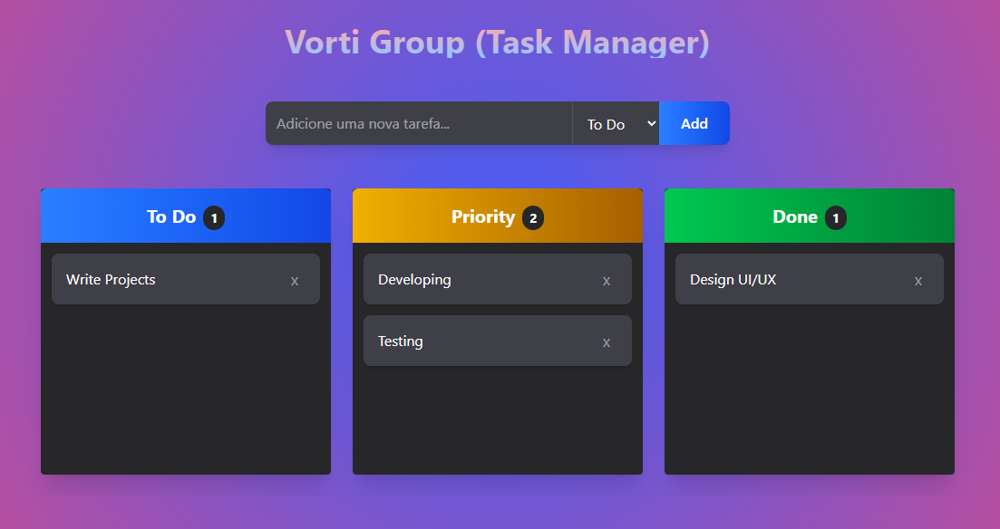

# 🚀 Vorti Board

Development of an internal workflow management tool for Vorti, built with React and Tailwind CSS. The system allows users to organize tasks, track progress, and optimize internal processes, providing a modern, responsive, and easy-to-use interface.

## ✨ Key Technical Highlights

- **React Architecture:** Built with functional components and **React Hooks** for efficient, modular state handling and scalability.
- **Tailwind CSS & UI Design:** Flexbox/Grid for responsive layouts and modern visual effects.
- **Native Drag & Drop:** Complex interactivity implemented, allowing seamless task migration without heavy external libraries.
- **Data Persistence & Logic:** Robust client-side input validation.
